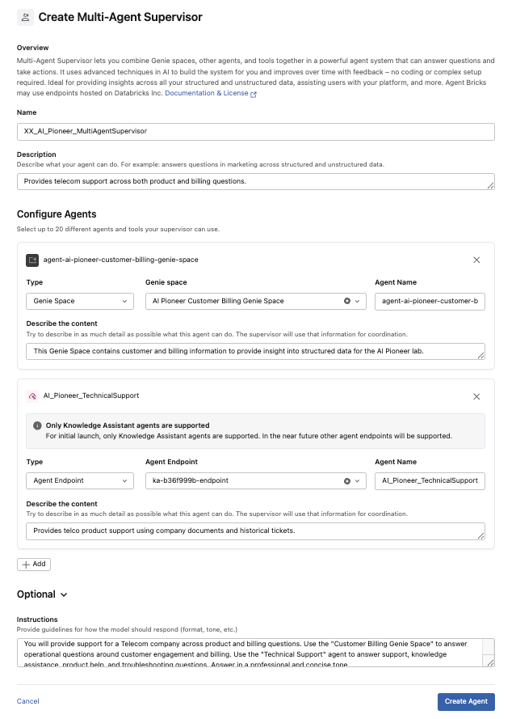
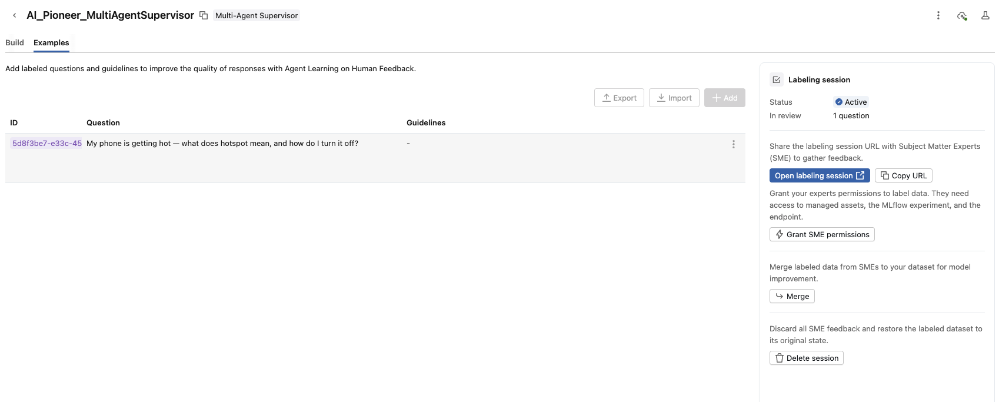
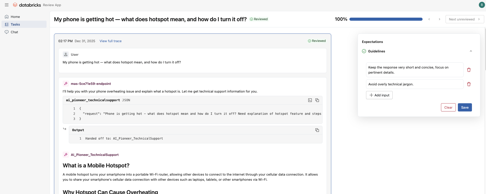
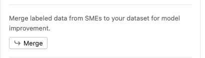

# Hands-On Lab: Building Agent Systems with Databricks

## Agent Bricks Lab: Build, Orchestrate, and Improve Multi-Agent Systems

In this lab, you’ll learn how to create and refine AI agents using **Databricks Agent Bricks**. If you are attending the proctored training, several of these agentic components have been pre-created so you can focus on the **Multi-Agent Supervisor**. Read Parts 1 & 2 to gain context of the full agentic solution, but please proceed to ⭐⭐Part 3⭐⭐.

*For those running this lab on your own or if you'd like to learn more about Knowledge Assistants and Genie, you can start by building a **Knowledge Assistant** grounded in company product docs and historical support tickets, then expand it with a **Genie-powered structured data agent**. Finally, you’ll orchestrate them together with a **Multi-Agent Supervisor** and guide the system to produce better, user-friendly responses.*

---

## Part 1: (OPTIONAL) Build Your First Knowledge Assistant
**THIS HAS BEEN PRE-CREATED FOR THE PROCTORED TRAINING** - Please use the `AI_Pioneer_TechnicalSupport` Knowledge Assistant Agent Brick. This serves as a Customer Service/Technical Support Agent which has access to our Telecom company's knowledge base and previous support tickets.

---

### 1.1 Create a Vector Search Index  
- **Why Vector Search?**  
  - Provides efficient retrieval of relevant chunks of data for grounding LLM responses.  
  - Two common types:  
    - **Triggered updates** (for static knowledge bases like FAQs/policies).  
    - **Continuous updates** (for dynamic sources like support tickets).  
- **Demo:** Indexes are pre-built for this lab, but you’ll see how easy it is to create one.

### 1.2 Build the Knowledge Assistant Agent
- **Navigate to “Agents”** in the UI.  
- **Create a new Knowledge Assistant** using the two pre-built vector search indices:  
  - **Knowledge Base** – Company details, FAQs, policies, and procedures.  
  - **Support Tickets** – Historical tickets and their resolutions.  
  - You can also explore creating a Knowledge Assistant off of raw text data where it handles the embedding for you.
- **Example setup:**  
  - **Name:** `[your_initials]_AI_Pioneer_TechnicalSupport`
    - **For those attending the proctored training, use the existing `AI_Pioneer_TechnicalSupport` agent.**
  - **Description:** Provides telco product support using company docs and historical tickets.  

### 1.3 Test the Knowledge Assistant  
- **Sample Question:** *How do I know if my 5G is working?*  
- Observe the verbose answer with citations and traces.  
- Explore how the assistant grounds responses in living, bespoke company data.

---

## Part 2: (OPTIONAL) Expand with Genie for Structured Data
**THIS HAS BEEN PRE-CREATED FOR THE PROCTORED TRAINING** - Please use the existing `AI Pioneer Customer Billing Genie Space`. This serves as a Genie Space (text-to-SQL querying) which has access to our Telecom company's billing and customer operational information.

---

### 2.1 Query Structured Data with Genie  
- **Genie spaces** allow natural language queries over structured data (SQL tables).  
- Genie is pre-configured to access **billing and customer tables**.  
- **Try It Out:**  
  - Ask *“What is the average total bill?”*  
  - Guide Genie with examples/instructions to better align with your data structures.  

### 2.2 Treat Genie as an Agent  
- Genie rooms can be registered as agents, enabling them to participate in multi-agent workflows.  
- Use Genie when customer-specific or billing data is required.

---
## Part 3: Orchestrate with a Multi-Agent Supervisor
⭐⭐Start here for the proctored training!⭐⭐

### 3.1 Create a Multi-Agent Supervisor (MAS)  
- Combines multiple agents (access to multiple disparate tools) to intelligently route queries coming from end users.
- **Navigate to “Agents”** in the UI on the left-hand pane under "AI/ML". 
- **Create a new Multi-Agent Supervisor** using existing agentic tools: 
- **Setup:**  
  - **MAS Name:** `[your_initials]_AI_Pioneer_MultiAgentSupervisor`  
  - **Description:** Provides telecom support across both product and billing questions.  
  - **Configure Agents:**  
    - Genie Space Agent
      - `AI Pioneer Customer Billing Genie Space`
      - Feel free to adjust the description.
    - Agent Endpoint Knowledge Assistant
      - `AI_Pioneer_TechnicalSupport` - The agent endpoint will begin with 'ka-', and your proctors will confirm which to use.
      - Feel free to adjust the description.
    - (OPTIONAL) UC Functions → Lookup and reference information created in the first lab.
  - **Provide Instructions under "Optional":**
    - You will provide support for a Telecom company across product and billing questions. Use the "Customer Billing Genie Space" to answer operational questions around customer engagement and billing. Use the "Technical Support" agent to answer support, knowledge assistance, product help, and troubleshooting questions. Answer in a professional and concise tone.
    - *Feel free to adjust and experiment with instructions!*

### 3.2 Test the MAS  
- **Billing Question:** *Why did my bill go up this month?*  
  - Add context: *Assume customer ID = `CUS-10001`, date = June 2025*.  
  - MAS should route query to Genie for customer-specific data.  
- **Support Question:** *My phone is getting hot - what does hotspot mean, and how do I turn it off?*  
  - MAS routes to Knowledge Assistant for product guidance.
- Try in AI Playground like we did in the first part of the lab!

---
## Part 4: Improve Quality with Feedback
**It will take ~15 minutes for label examples to be generated from creation in order to update and improve your agent. This is a good time to take a break, look at the existing Knowledge Assistant Agent and Genie Space Agent, and/or ask the proctors questions. Once examples are generated, you'll be able to test and improve your MAS!**

### 4.1 Identify Response Issues  
- We need to supply the Agent with questions and guidelines to evaluate it on and give it directions of how/where to improve. We'll keep it simple by adding our own questions, but you can also import existing list of questions.
- For our example, some answers may be too verbose or technical for end users. *Example: The hotspot explanation may be correct but overly long.*

### 4.2 Provide Feedback via Labeling Session  
- Click **“Examples”** on the agent header to move off the **"Build"** UI.
- Add the question: *“My phone is getting hot — what does hotspot mean, and how do I turn it off?”*

- Next, open a labeling session by **"Start labeling session"** → **"Open labeling session"** to launch. This will launch the **"Review App"** which is an inbuilt tool designed to collect feedback and expectations on Agent task completion. The purpose of a labeling session is to run your agent against baseline questions, evaluate them, and collect feedback which, in turn, improves the agent.

  - Add input *“Keep the response very short and concise, focus on pertinent details.”* and then Save.
  - If you'd like, you can add additional questions and you'll see them pop up in the Review App, and you can provide feedback. Or you can provide different Guidelines to see the impact.
- Once complete providing feedback to the example questions, go back to your Agent and "Merge" feedback which completes the labeling session and pushes the feedback to the MAS to improve.

### 4.3 Re-test the Agent  
- Verify concise responses are now produced by re-asking the question either in AI Playground of the Build screen.
- Observe how natural language feedback guides behavior without coding.
- Come up with and ask additional questions and provide natural language feedback to engage with the supervisory agent. Experiment with adding/removing tools as well to see how effective the stochastic nature is.

You can find more documentation here: https://docs.databricks.com/aws/en/generative-ai/agent-bricks/multi-agent-supervisor#what-is-agent-bricks-multi-agent-supervisor

---

## Next Steps In Getting To Production
- **Governance & Permissions:** Use Unity Catalog to control agent access on behalf of users.  
- **Real-World Extension:** Continuously stream support tickets into your knowledge base.  
- **Multi-Agent Patterns:** Add more specialized agents (e.g., troubleshooting, recommendations).  
- **Production Deployment:** Register agents, monitor with MLflow, and integrate with apps or support portals.  

🎉 Congratulations! You’ve built a **Multi-Agent system with Agent Bricks** that combines structured and unstructured data, routes intelligently, and adapts with user feedback. 
